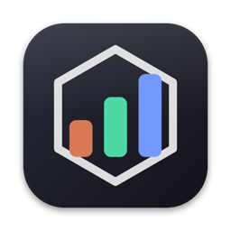
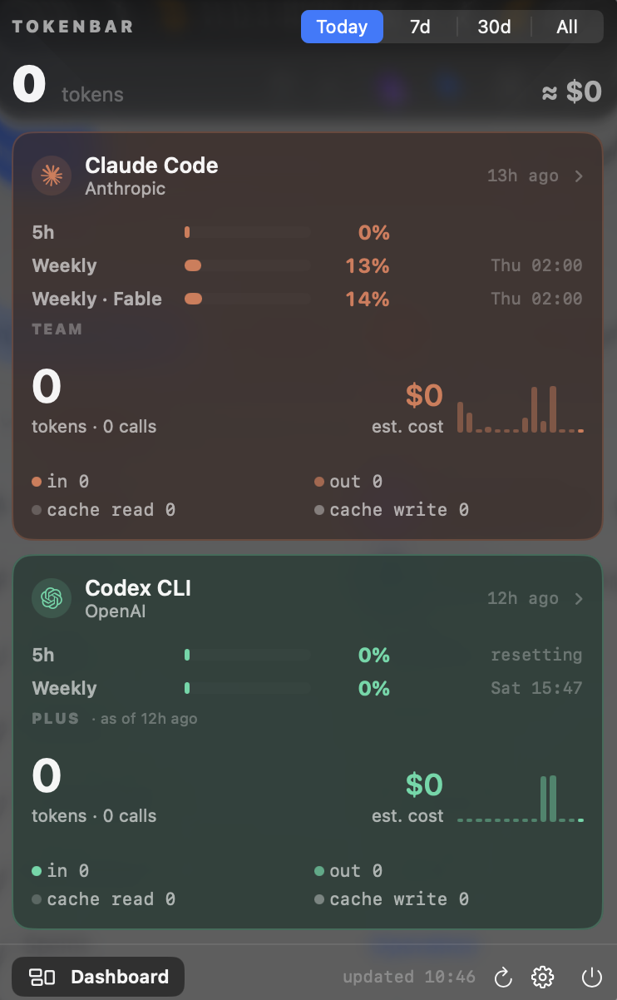
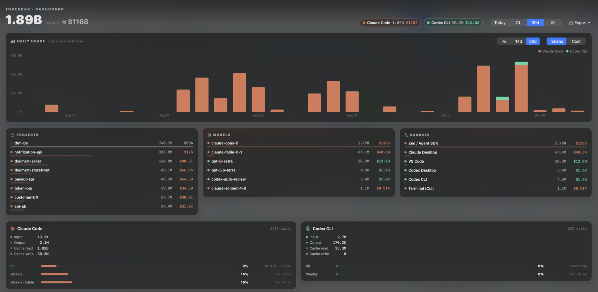

<p align="center">
  
</p>

<h1 align="center">TokenBar</h1>

<p align="center">
  Token usage, estimated cost and rate limits for your AI coding tools — in the macOS menu bar.<br>
  Reads local logs only. No API keys, no accounts, no telemetry.
</p>

<p align="center">
  <a href="https://github.com/Techit-Kakaew/token-bar/releases/latest"></a>
  <a href="https://github.com/Techit-Kakaew/token-bar/actions/workflows/ci.yml"></a>
  
  
</p>

<p align="center">
  
</p>

## Features

- **Usage at a glance** — tokens and list-price cost for Today / 7d / 30d / All, split into input, output, cache read and cache write, with a 14-day sparkline per tool.
- **Rate limits** — Claude 5-hour and weekly windows (incl. per-model weekly), Codex 5-hour and weekly, with reset countdown and clock time.
- **Where it came from** — usage attributed to source (Terminal, Claude Desktop, Zed, VS Code, …) and to project folder.
- **Live sessions** — conversations active in the last 15 minutes, named by their first prompt, grouped per project (`codex-project ×3`), sorted near-full-context → active → idle, with a **context-window gauge**; notification at 80 % so you can `/compact` before it auto-compacts. Subagent calls fold into their parent session. Collapsible, top 3 groups + "more" (⚙️ → Live sessions).
- **Dashboard window** — 30-day stacked chart, top projects / models / sources; click a bar to drill into one day.
- **Alerts** — limit thresholds (80 % / 95 %), daily and weekly spend budgets, and a break reminder after long continuous use.
- **Menu bar, your way** — combined total or a single tool (its logo + tokens + worst limit); amber / red when a limit is close.
- **Export** — events CSV, daily CSV, Markdown report; also headless from the CLI.
- **Native** — Liquid Glass on macOS 26, light / dark / system, English or Thai, global hotkeys, launch at login.

## Install

Download the latest `.dmg` from **[Releases](https://github.com/Techit-Kakaew/token-bar/releases/latest)** and drag
TokenBar.app to Applications. Universal binary (Apple Silicon + Intel), macOS 14 or newer.

The app is **not notarized** yet (no Apple Developer account), so on first launch macOS may say it is damaged or from an
unidentified developer. Run this once (removes the download quarantine flag and re-signs the app locally), then open it normally:

```bash
xattr -cr /Applications/TokenBar.app && codesign --force --deep --sign - /Applications/TokenBar.app
```

If macOS still blocks it (macOS 15+ removed the right-click → Open bypass), go to
**System Settings → Privacy & Security**, scroll down and click **Open Anyway**.

**Updating**: TokenBar checks GitHub every 6 hours. When a new version exists you get a notification (once per version) and a badge in the popover footer —
one click downloads the `.dmg`, verifies its SHA-256 against the release, swaps the app bundle in place, clears
quarantine, re-signs and relaunches. No Terminal needed after the first install.

On first launch TokenBar explains what it reads and asks before requesting anything:

- **Claude limits** (optional) — reads Claude Code's login token from your Keychain to fetch 5h / weekly limits. macOS prompts once; choose *Always Allow*.
- **Notifications** (optional) — for limit, budget and break alerts.

Both can be changed later in the ⚙️ menu.

## Supported tools

| Tool | Reads | Status |
|---|---|---|
| **Claude Code** — CLI, Claude Desktop, Zed (ACP), VS Code, Agent SDK | `~/.claude/projects/**/*.jsonl` | verified |
| **Codex CLI** — CLI, Codex Desktop, VS Code | `~/.codex/sessions/**/*.jsonl` | verified |
| **Zed Agent** (Zed's native panel) | `~/Library/Application Support/Zed/threads/threads.db` (needs `brew install zstd`) | verified — no per-message timestamps, usage is dated by thread `updated_at` |
| **Gemini CLI** | `~/.gemini/tmp/*/chats/*.json` | from Gemini CLI source, not exercised locally |
| **Qwen Code** | `~/.qwen/tmp/*/chats/*.json` | Gemini CLI fork, unverified |
| **OpenCode** | `~/.local/share/opencode/storage/message/*/*.json` | unverified — [open an issue](https://github.com/Techit-Kakaew/token-bar/issues) with a sample if it misparses |

Tools with no local data are hidden. Cursor, Windsurf, Copilot and the web chats keep no readable local usage and cannot be supported.
Adding a tool means implementing `UsageSource` (roots, matches, parse) and a `Provider` case.

Rate limits come from `api.anthropic.com/api/oauth/usage` (Claude, polled every 5 min; if the token expires, run `claude` once)
and from the `rate_limits` payload in Codex session logs (updates while Codex runs).

## Dashboard



Opens from the popover footer (or a hotkey). 7 / 14 / 30-day stacked daily chart in tokens or cost, top **projects**
(from the working directory in the logs), **models** and **sources**, plus per-tool breakdown with limit gauges.
Click a bar to scope everything to that day; click again or *Back* to return.

**Export** (dashboard header) writes events CSV for the last 30 days or the selected day, a daily summary CSV, or a
Markdown report for the selected window. The same outputs are available headless:

```bash
/Applications/TokenBar.app/Contents/MacOS/TokenBar --export events 7d  > events.csv
/Applications/TokenBar.app/Contents/MacOS/TokenBar --export daily      > daily.csv
/Applications/TokenBar.app/Contents/MacOS/TokenBar --export report 30d > report.md
```

## Alerts, budgets, hotkeys

All in the ⚙️ menu:

| Setting | Behaviour |
|---|---|
| Context alert | Notification once per session when a live session's context passes 80 % of the model's window (window sizes in `ContextWindows`, Codex reports its own). |
| Limit alert | Notification when any 5h / weekly window crosses 80 % (choose off / 70 / 80 / 90) and again at 95 %, once per reset cycle. Menu-bar icon turns amber / red and shows the worst percentage. |
| Daily / weekly budget | Progress row under the totals; notification at 80 % and 100 %, once per period. Amounts are list-price estimates. |
| Break reminder | Continuous use (calls less than 15 min apart) for 90 min → "take a break" notification, repeating every 45 min. All three values adjustable. |
| Hotkeys | Toggle the popover (default `⌥⇧T`) and open the dashboard. Carbon hotkeys, no Accessibility permission. |
| Hide a tool | Hover a card → 👁 (or right-click → Hide). Hidden tools drop out of the popover, dashboard and totals; a "Hidden:" chip row (or ⚙️ → Hidden providers) brings them back. Alerts keep firing for hidden tools. |
| Menu bar shows | Combined total, one fixed tool (logo + tokens + limit), or **follow the live session** — the icon switches to whichever tool you are using right now and falls back to the combined view when nothing is active. |
| Theme / Language | System / light / dark; system / English / ไทย. |

## Privacy

- Reads local log files only. Nothing is uploaded; no telemetry, no analytics, no identifiers.
- Network calls: the optional Claude limits request above, a once-a-day check of the GitHub Releases API for new versions, and — only when you click *Update* — the download of the release `.dmg` from GitHub.
- Settings are stored in `UserDefaults` (`dev.techit.tokenbar.app`); parsed results are cached in `~/Library/Caches/dev.techit.tokenbar.app/`.

## Cost estimates

Costs are **what the same tokens would cost at list price** (USD per 1M tokens, per model, with cache read / write rates),
not what you were billed — useful for judging a subscription or comparing tools. The built-in table lives in
`Sources/TokenBar/Pricing.swift`; override or add models in `~/.config/tokenbar/pricing.json`, matched by model-id prefix:

```json
{ "gpt-5.6": { "input": 1.75, "output": 14, "cacheRead": 0.175, "cacheWrite": 0 } }
```

## Development

Swift Package, SwiftUI `MenuBarExtra`, no Xcode project. Requires Xcode 16+ (Xcode 26 for the Liquid Glass path).

```bash
./build.sh --install     # native build → /Applications/TokenBar.app
./build.sh --dmg         # universal build → dist/TokenBar-<version>.dmg
swift test               # parser fixtures, pricing, streaks, export, versions
```

Useful flags on the built binary: `--dump` (aggregated stats), `--streak`, `--notify-test`, `--icon`,
`--snapshot out.png` / `--snapshot-dashboard out.png` (render views to PNG; env `TOKENBAR_SNAPSHOT_LANG=th`,
`TOKENBAR_SNAPSHOT_SCHEME=light`, `TOKENBAR_SNAPSHOT_DAY=1`).

**Release**: bump `CFBundleShortVersionString` / `CFBundleVersion` in `Info.plist`, commit, then
`git tag vX.Y.Z && git push origin vX.Y.Z`. GitHub Actions builds the universal dmg and publishes the release.

**Icons**: app icon from `Assets/AppIcon.xcassets` (regenerate with `scripts/make_appicon.swift`, compiled by `actool`
in `build.sh`); menu-bar template icon from `scripts/make_icon.swift`; vendor logos in `Sources/TokenBar/Resources/logos/`
(Claude, Gemini, OpenAI marks as published by [Simple Icons](https://simpleicons.org), CC0 — trademarks belong to their owners).

## Credits & license

Made by [Techit Kakaew](https://github.com/Techit-Kakaew). Built with Claude Code.
Released under the [MIT License](LICENSE).
